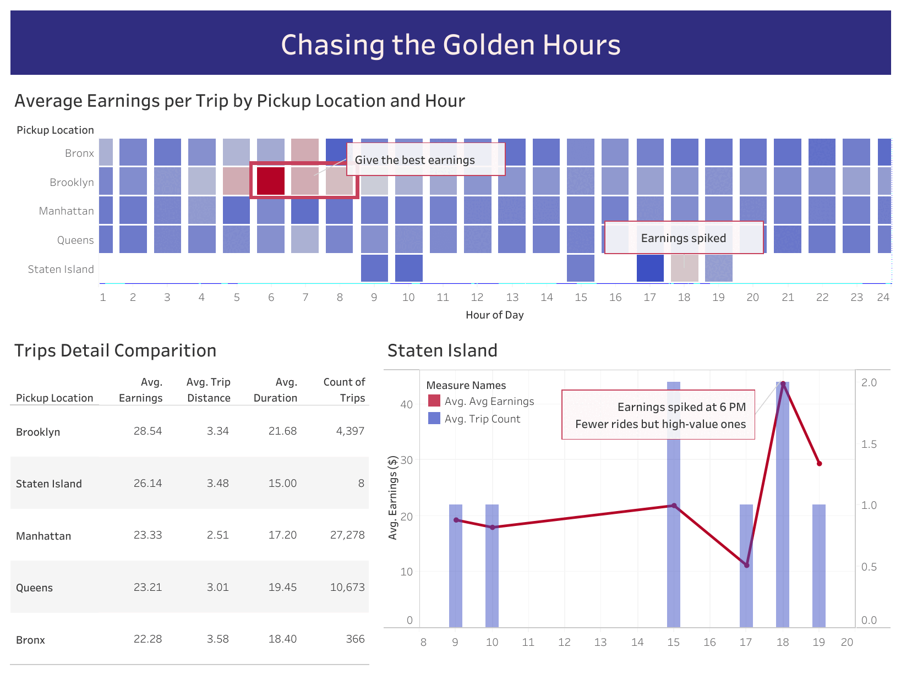
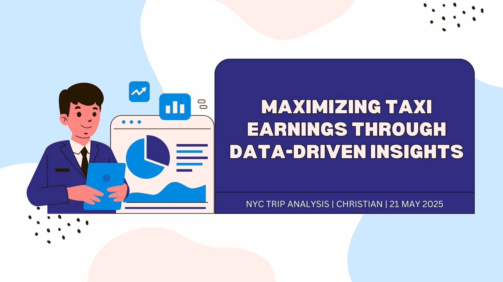

# 🚕 NYC Taxi Earnings Analysis

**Maximizing Taxi Earnings Through Data-Driven Insights**

## 📊 Project Overview

This project explores over 60,000 NYC taxi trips to uncover patterns in earnings, tips, and trip efficiency. The goal is to identify strategic opportunities for taxi drivers to maximize income through better route timing, customer behavior insights, and efficiency metrics.

## 🎯 Objectives

* Identify the most profitable pickup zones and hours
* Analyze key factors influencing tips
* Detect inefficient trips with high time/low returns
* Compare trip profitability by payment method and tip segment

## 🔍 Key Insights

| 🔹 Focus Area                | 🔍 Insight                                                              |
| ---------------------------- | ----------------------------------------------------------------------- |
| Time & Location Optimization | Brooklyn at 6–8 AM and Staten Island at 6 PM yield the highest earnings |
| Tip Influencing Factors      | Longer trips and higher fares correlate with higher tips                |
| Efficiency Trap              | Bronx and Brooklyn show low-return trips in early hours                 |
| Payment Method Impact        | Credit card users tip more, especially after noon                       |

## 🧠 Tools Used

* Python (Pandas, Matplotlib, Seaborn)
* Tableau (Dashboard)
* Jupyter Notebook
* Canva

## 🗂️ Dataset

* Source: [NYC TLC Trip Record Data](https://www.nyc.gov/site/tlc/about/tlc-trip-record-data.page)
* Filtered for January 2023
* Sample size: \~60K trips

## 📽️ Presentation

---

## 📌 Recommendations

* 🚖 **Deploy more drivers to Brooklyn early mornings (6–8 AM)**
* 📍 **Target Staten Island in the evenings for fewer but high-value trips**
* 💳 **Encourage card payments – these yield better tips**
* ⚠️ **Avoid early morning short trips in Bronx and Brooklyn to save time**

## ✍️ Author

Christian (Chrata)\
📅 May 2025
